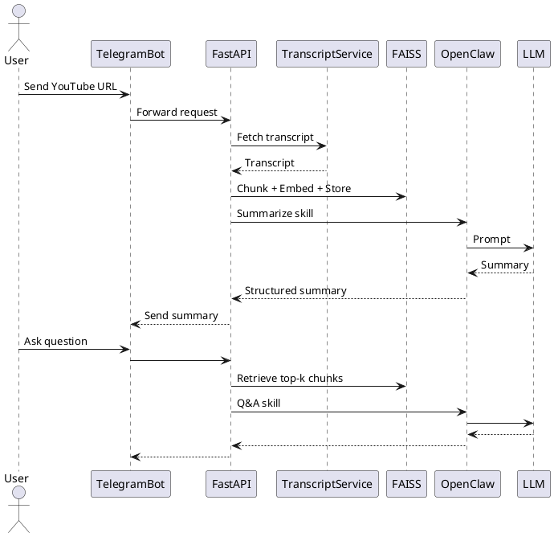

# 🚀 Telegram YouTube Summarizer & Q&A Bot  
**Powered by OpenClaw**

---

## 📌 Overview

This project is a **Telegram AI assistant** that transforms YouTube videos into structured knowledge:

- 🎥 Accepts a YouTube link  
- 📜 Fetches the transcript  
- 📝 Generates a structured summary  
- ❓ Supports contextual Q&A  
- 🌍 English + Hindi support  
- 🛡 Prevents hallucinations using Retrieval-Augmented Generation (RAG)  
- ⚙️ Uses **OpenClaw** as the orchestration layer  

Think of it as your **personal AI research assistant for YouTube videos**.

---

## 🏗 Architecture Overview

### High-Level Design



---

## 🧠 Why OpenClaw?

OpenClaw acts as the **AI orchestration layer**, ensuring clean, reliable, and extensible interactions.

### Responsibilities
- 🧩 Prompt templating  
- 🚫 Enforcing "no hallucination" policy  
- 🌐 Language control injection  
- 📑 Response structure enforcement  
- 🔄 Model abstraction  
- 🔮 Future extensibility (tools, memory, agents)  

---

## 🎯 Skills Implemented

### 1️⃣ `summarize_video`

**Input**  
- video_title  
- transcript_text  
- target_language  

**Output**  
- 🎥 Title  
- 📌 5 Key Points  
- ⏱ Important Timestamps  
- 🧠 Core Takeaway  

---

### 2️⃣ `answer_question`

**Input**  
- retrieved_chunks  
- user_question  
- target_language  

**Output**  
- Grounded answer  
- OR `"This topic is not covered in the video."`

---

## 🔎 Retrieval-Augmented Generation (RAG)

To guarantee grounded answers:

1. Transcript chunked (~1000 tokens, 15% overlap)  
2. Embedded into vector space  
3. Stored in FAISS  
4. User question embedded  
5. Top-5 chunks retrieved  
6. Only retrieved chunks sent to LLM  

**System Prompt:**

```
Answer ONLY using the provided transcript context.
If the answer is not present, respond exactly:
"This topic is not covered in the video."
```

---

## 🌍 Multi-language Support

- ✅ English (default)  
- ✅ Hindi  

**How it works:**  
User can send commands like:  
- `Summarize in Hindi`  
- `/lang hi`  

OpenClaw injects:  
```
Respond in Hindi.
```

No translation layer required — leveraging LLM’s multilingual capability.

---

## 🧩 Tech Stack

| Layer            | Technology              |
| ---------------- | ----------------------- |
| Backend          | FastAPI                 |
| Telegram         | python-telegram-bot     |
| Transcript       | youtube-transcript-api  |
| Vector Store     | FAISS                   |
| Database         | SQLite                  |
| AI Orchestration | OpenClaw                |
| LLM              | OpenAI-compatible model |

---

## 🗄 Database Schema

### Users
| Field              | Type     |
| ------------------ | -------- |
| id                 | PK       |
| telegram_id        | unique   |
| preferred_language | string   |
| created_at         | datetime |

### Videos
| Field           | Type     |
| --------------- | -------- |
| id              | PK       |
| video_id        | unique   |
| title           | string   |
| transcript_text | text     |
| summary_text    | text     |
| created_at      | datetime |

### TranscriptChunks
| Field       | Type |
| ----------- | ---- |
| id          | PK   |
| video_id    | FK   |
| chunk_index | int  |
| chunk_text  | text |

### Sessions
| Field               | Type     |
| ------------------- | -------- |
| id                  | PK       |
| user_id             | FK       |
| video_id            | FK       |
| last_interaction_at | datetime |

---

## ⚙️ Setup Instructions

1️⃣ **Clone Repository**
```bash
git clone https://github.com/your-username/telegram-youtube-bot.git
cd telegram-youtube-bot
```

2️⃣ **Install Dependencies**
```bash
pip install -r requirements.txt
```

3️⃣ **Setup Environment Variables**
Create `.env`:
```
TELEGRAM_BOT_TOKEN=your_token
OPENAI_API_KEY=your_key
OPENCLAW_BASE_URL=http://localhost:3000
```

4️⃣ **Start OpenClaw**
```bash
openclaw start
```

5️⃣ **Run FastAPI Server**
```bash
uvicorn app.main:app --reload
```

6️⃣ **Start Telegram Bot**
```bash
python bot.py
```

---

## 🧪 Example Usage

**Step 1 — Send YouTube Link**
```
https://youtube.com/watch?v=XXXXX
```

Bot Response:
```
🎥 Video Title

📌 5 Key Points
1.
2.
3.
4.
5.

⏱ Important Timestamps
00:10 – ...
05:42 – ...

🧠 Core Takeaway
...
```

**Step 2 — Ask Question**
```
What did he say about pricing?
```

Bot:
```
He explained that pricing depends on...
```

If not found:
```
This topic is not covered in the video.
```

---

## 🚨 Edge Case Handling

| Case            | Handling                    |
| --------------- | --------------------------- |
| Invalid URL     | Validation + error message  |
| No transcript   | Graceful response           |
| Very long video | Automatic chunk scaling     |
| Multiple users  | Session isolation           |
| Rate limits     | Retry + exponential backoff |

---

## 📈 Future Improvements

- ⚡ Redis caching  
- 💾 Persistent FAISS storage per video  
- 📬 Async task queue (Celery)  
- 🐳 Dockerization  
- 🌐 Production deployment  
- 📊 Analytics dashboard  

---

## 🎥 Demo

Include in repository:  
- 3–5 minute demo video  
- Screenshots of:  
  - Summary output  
  - Q&A output  
  - Hindi response  
  - Error handling  

---

## 🏁 Evaluation Mapping

| Criteria                 | Addressed                      |
| ------------------------ | ------------------------------ |
| End-to-end functionality | ✅                              |
| Summary quality          | Structured + Prompt-controlled |
| Q&A accuracy             | RAG + strict grounding         |
| Multi-language support   | English + Hindi                |
| Code quality             | Modular architecture           |
| Error handling           | Explicit cases handled         |

---

## 📌 Conclusion

This project delivers:  
- A grounded AI system  
- Clean architecture  
- Business-focused summarization  
- Extensible foundation for production  

---
